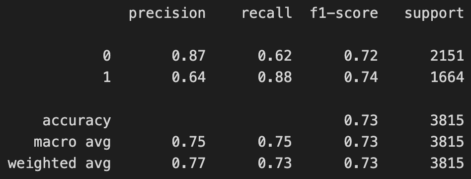
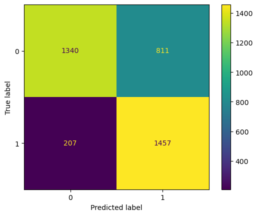

# Billboard-Top-100-project

## Project 4 for UMN Data Bootcamp for Team 2

#### **Team members:** Cody Bassett, Glen Dagger, Juan Marin, Taylor Marino

#### Live Github Pages link: 

### Our Site:

Our goal was to create a website that could predict the likelihood of a song being a Billboard Top 100 song in a specific decade based on its Spotify audio features. A user can input any song/artist and a specific decade, then the site will present a percentage of how likely it is of being a top charting song during that timeframe.

### **Process**:

- In order to create this website we started off by compiling Spotify song features from the top 100 charting songs in every decade from 1960-2010. While also gathering the Spotify song features for songs in each decade that were not top charting songs. After organizing the features for non charting and charting songs we created a database to store all of it. We then trained a separate machine learning model in every decade to try to establish whether the top charting songs can be distinguished by their audio features.
- _____
- _____

### **Data**

-  [Spotify API](https://developer.spotify.com/documentation/web-api/reference/#/operations/get-several-audio-features)

- [1.2M+ Spotify Songs (Kaggle)](https://www.kaggle.com/datasets/rodolfofigueroa/spotify-12m-songs)
  
- [Billboard "The Hot 100" Songs (Kaggle)](https://www.kaggle.com/datasets/dhruvildave/billboard-the-hot-100-songs)

The data we used for this website was a Kaggle dataset that gathered 1.2 million Spotify songs and their features, as well as another dataset from Kaggle that combined all songs from the Billboard Hot 100 weekly charts since 1958. We also used the Spotify API to pull audio features of top Billboard songs that were not included in the Kaggle dataset.

### Data Extraction and Processing

To process the data, we first downloaded the CSV files from Kaggle and set up our Spotify Developer API keys. Since our goal was to combine all charting and non-charting songs into one large dataset along with the Spotify audio features for each track, we needed to get the Spotify Track ID for the Billboard songs as they were already included, along with their features, in the Spotify dataset. To achieve this, we defined a function that makes a query to Spotify through the Spotipy Package to return a track ID from a song name and artist, and a separate function that queries the track ID and returns its audio features. 

Due to the inconsistencies in the syntax of song and artist names between the Billboard chart and the Spotify API, we had to include several more functions that cleaned the song/artist names and adjusted for special characters and key words like "Featuring". This allowed us to try several combinations per song and increase the likelihood of a positive match. Ultimately we were able to successfully match over 90% of the data from our Billboard data set with a Spotify track ID. This was done on each decade subset of the dataframe by applying these functions to the Billboard dataset using the Swifter package for significantly increased effiency (the Pandas apply method took hours longer to complete, whereas the Swifter apply method only took approximately 30 minutes per decade).

We added a column to label the decade for each track, and wrote another function that retrieved the audio features from the Spotify API through Spotipy and added them as new columns to the dataframe. We decided to drop the 'key', 'mode', and 'time signature' features since these seemed to have no correlation at all with the time period, after looking at a few graphs of these values over time. At this point, we dropped any rows that contained null or missing values, removed all duplicates and removed from the non-charting dataset all songs that were present in the Billboard dataset to avoid overlap of labeled data. The Spotify dataset was filtered down to only the necessary columns ('song', 'artist', 'year', 'peak-rank', 'weeks-on-board', 'track_id', 'danceability', 'energy', 'key', 'loudness', 'mode', 'speechiness', 'acousticness', 'instrumentalness', 'liveness', 'valence', 'tempo','duration_ms', 'time_signature', 'billboard'). Both datasets were merged and exported as a large csv file containing nearly 1.5 million rows of data.

### Machine Learning

Our goal was to create models that would take in the audio features of a song and return a probability-based likelihood of that song being a hit within a particular decade based purely on its audio features: 'danceability', 'energy', 'loudness', 'speechiness', 'acousticness', 'instrumentalness', 'liveness', 'valence', 'tempo', and 'duration_ms'. More information on each feature can be found on the [Spotify for Developers](https://developer.spotify.com/documentation/web-api/reference/#/operations/get-several-audio-features) website. 

We first examined a correlation heatmap to identify any strongly correlated features. While 'loudness' and 'energy' appeared to have the strongest correlation with one another (and a fairly strong negative correlation of about -0.8 with 'acousticness'), the features for the most part appeared to be fairly independent and all were included in our feature set.

 

We initially selected a Logistic Regression model but quickly realized we needed to adjust for the imbalanced dataset (non-charting songs far exceed the number of Billboard songs for each decade). We wanted to maximize precision as we wanted to prioritize false negatives (Billboard charting songs that the model identifies incorrectly as non-hits) over false positives (non-charting songs that are identified incorrectly as hits). Because of the imbalance between the data labeled as charting vs. non-charting, we were not concerned with the overall accuracy score of the model. In the end we decided to use an SVM due to slight increases in accuracy, although it ended up being more computationally expensive.

All models used some form of undersampling (sampling from the non-charting songs using the Pandas sample method to reduce the relative size and improve speed) and oversampling (using the Synthetic Minority Oversampling Technique Imbalanced-Learn package to create synthetic samples of Billboard data and increase its relative size). 

We split the data into testing and trainging datasets, applied a MinMaxScaler to the training data used it to scale the feature data. The scaler for each model was saved using the Pickle library in order to scale new song features and make predictions. Below is the confusion matrix and classification report for the 1960s model results.

From this we can see that this particular model has accuracy and precision scores of roughly 64% for predicted hits. This was better than expected since we were not certain that there would even be any relationship between the selected audio features of a song and whether it reached the Billboard weekly charts. Each model varied in its levels of precision. All models were saved and exported using the Pickle module so that we could load them in and make probability predictions.

#### Presentation Link: 
- https://docs.google.com/presentation/d/1HYz67E426ZDcFdiULjEukrsEuF019WVo4cjyy10KwFE/edit#slide=id.g2040c6cffc0_0_194

### Limitations
- 

### Future Possibilities**: 
In future projects we would like to compile more features for each song. Since each song only had 12 features it was difficult to create an accurate model for predicting a top charting song. With more features, like genre, lyrics, and other qualities, the model would have more information to create a more accurate prediction. 

###** Website Image**

